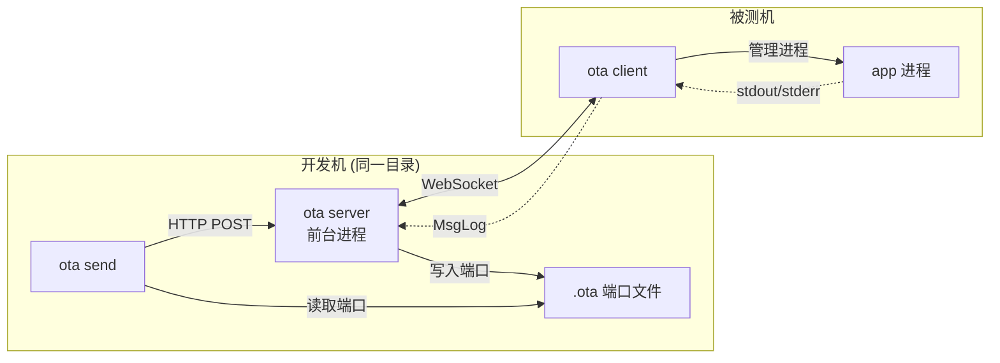

# OTA - 空中二进制部署

[English](README.md)

将编译好的二进制推送到远程机器并立即运行。专为跨网络设备的快速 编辑-编译-测试 循环而构建。

## 工作原理

```
┌─────────────────────────────┐          ┌──────────────────────────┐
│      开发机                  │          │     被测机                │
│                             │          │                          │
│  ota server (前台运行)       │◄════════►│  ota client              │
│    ├─ HTTP  /send           │ WebSocket│    ├─ 接收二进制          │
│    ├─ HTTP  /stop,kill      │          │    ├─ 停止旧进程          │
│    ├─ HTTP  /restart        │          │    ├─ 启动新进程          │
│    ├─ HTTP  /disconnect     │          │    │                     │
│    └─ WS   /ws              │          │    │                     │
│                             │          │    └─ 回传日志            │
│  ota send ./build/app ──────┼──►       │                          │
│                             │          │                          │
│  终端输出:                   │          │                          │
│    [client] received app    │◄─────────│  app stdout/stderr       │
│    [app:err] listening :80  │          │                          │
└─────────────────────────────┘          └──────────────────────────┘
```

## 快速开始

### 安装

```bash
git clone https://github.com/xxnuo/ota.git
cd ota
make install    # 编译并安装到 ~/.local/bin/ota
```

### 1. 启动 Server（开发机）

```bash
cd your-project
ota server              # 自动选择端口，写入 .ota 文件
ota server -p 9867      # 或指定端口
```

Server 在前台运行，Client 和 App 的所有日志都会显示在这里。

### 2. 启动 Client（被测机）

```bash
ota client -s ws://开发机地址:9867 -d /opt/app
```

或使用环境变量：

```bash
export OTA_SERVER=ws://开发机地址:9867
ota client -d /opt/app
```

Client 会自动连接并等待接收二进制文件。断线后自动重连。

### 3. 发送二进制

在开发机上，与 `ota server` 同一个目录下：

```bash
# 编译你的程序，然后发送
go build -o ./build/app .
ota send ./build/app
```

Client 收到后会：
1. 停止当前运行的 app（先 SIGTERM，500ms 后 SIGKILL）
2. 将新二进制写入工作目录
3. 启动新二进制
4. 将所有 stdout/stderr 实时回传到 Server 前台

### 4. 控制运行中的程序

```bash
ota stop                # 优雅停止（SIGTERM，500ms 后 SIGKILL）
ota kill                # 强制杀死（SIGKILL）
ota restart             # 停止 + 重启上次发送的二进制
```

### 5. 断开连接

```bash
ota disconnect
```

Client 会停止正在运行的 app 并退出。

## 命令一览

| 命令 | 说明 |
|------|------|
| `ota server [-p PORT]` | 前台启动服务器（0 = 自动端口） |
| `ota client -s URL [-d DIR]` | 连接服务器，等待接收二进制 |
| `ota send <file> [--args "..."]` | 发送二进制到已连接的 Client |
| `ota stop` | 优雅停止运行中的程序（SIGTERM） |
| `ota kill` | 强制杀死运行中的程序（SIGKILL） |
| `ota restart` | 停止并重启上次发送的二进制 |
| `ota disconnect` | 断开 Client 连接并使其退出 |

## 基于目录的端口文件

`ota server` 启动时会在当前目录写入 `.ota` 文件（内容为端口号）。`ota send` 和 `ota disconnect` 自动读取该文件。

因此你可以在不同项目目录下运行多个独立的 Server：

```
~/project-a/  →  ota server (端口 41523)  →  .ota 内容为 "41523"
~/project-b/  →  ota server (端口 38901)  →  .ota 内容为 "38901"
```

在 `~/project-a/` 下执行 `ota send ./app` 会自动发送到正确的 Server。

## 带参数发送

```bash
ota send ./myapp --args "-port 8080 -config prod.yaml"
```

Client 端会执行：`./myapp -port 8080 -config prod.yaml`

## Docker / Compose

### docker-compose.yml

```yaml
services:
  server:
    build: .
    command: ["server", "-p", "9867"]
    ports:
      - "9867:9867"

  client:
    build: .
    command: ["client", "-s", "ws://server:9867", "-d", "/workspace"]
```

```bash
docker compose up -d
echo "9867" > .ota   # 让本地 ota send 能访问容器内的 server
ota send ./build/app
```

## Demo

`demo/` 目录下包含一个示例 Go HTTP 服务器：

```bash
# 终端 1：启动 server
cd ota
ota server -p 9867

# 终端 2：编译并发送
cd ota/demo
make send         # 编译 v1 并发送
make v2           # 编译 v2 并发送（热替换）
make v3           # 编译 v3 并发送
```

## 通讯协议

使用 WebSocket 传输 JSON 消息：

| 消息类型 | 方向 | 用途 |
|---------|------|------|
| `binary` | server → client | 二进制文件传输（文件名 + 内容 + 参数） |
| `log` | client → server | 日志行（来源 + 内容） |
| `stop` | server → client | 优雅停止运行中的程序 |
| `kill` | server → client | 强制杀死运行中的程序 |
| `restart` | server → client | 停止并重启上次发送的二进制 |
| `disconnect` | server → client | 通知 Client 退出 |
| `ping/pong` | 双向 | 心跳保活 |

## 构建

```bash
make build          # 编译当前平台
make build-linux    # 交叉编译 linux amd64/arm64
make install        # 编译 + 安装到 ~/.local/bin
make test           # 运行测试
make clean          # 清理构建产物
```

## 架构简图



## 许可

见 [LICENSE](LICENSE)。
